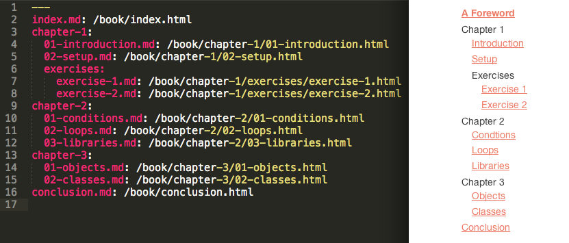
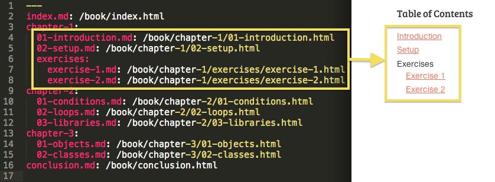
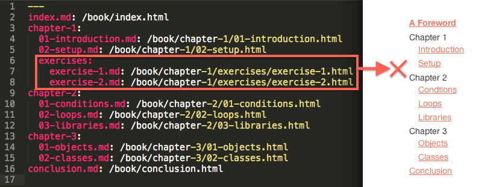
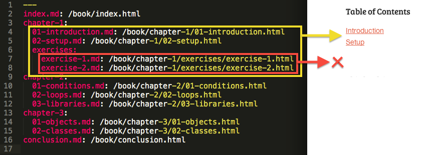

# Middleman-NavTree

`middleman-navtree` is an extension for the Middleman static site generator that lets you generate navigation trees and menus based on your site structure.

## Installation

Add this line to your application's Gemfile:

    gem 'middleman-navtree'

And then execute:

    $ bundle install

Activate the extension with default options by adding the following to middleman's `config.rb`:

    activate :navtree

Alternatively, you can specify the options you want. Here's an example showing the explicit defaults:

    activate :navtree do |options|
      options.data_file = 'tree.yml' # The data file where our navtree is stored.
      options.automatic_tree_updates = true # The tree.yml file will be updated automatically when source files are changed.
      options.ignore_files = ['sitemap.xml', 'robots.txt'] # An array of files we want to ignore when building our tree.
      options.ignore_dir = ['assets'] # An array of directories we want to ignore when building our tree.
      options.home_title = 'Home' # The default link title of the home page (located at "/"), if otherwise not detected.
      options.promote_files = ['index.html.erb'] # Any files we might want to promote to the front of our navigation
      options.ext_whitelist = [] # If you add extensions (like '.md') to this array, it builds a whitelist of filetypes for inclusion in the navtree.
    end

## Usage Examples

When you activate the extension, a tree.yml file will be added to your `data` folder, mimicking your directory structure. Suppose the structure looks like this:

We can print the entire navigation tree to our template with the `tree_to_html` helper:

    <ul><%= tree_to_html(data.tree) %></ul>

Here's the tree.yml file and the resulting rendered navtree (styled):

`data.tree` refers to the contents of `/data/tree.yml` (see http://middlemanapp.com/advanced/local-data/ for more information about data files).

You can just as easily print subtrees at any level:

    <ul><%= tree_to_html(data.tree['chapter-1']) %></ul>

    <ul><%= tree_to_html(data.tree['chapter-1']['exercises']) %></ul>

A second paramter allows you to limit the depth of your trees and subtrees:

    <ul><%= tree_to_html(data.tree, 2) %></ul>

You can combine both techniques to print menus at any level, with a specific depth:

    <ul><%= tree_to_html(data.tree['chapter-1'], 1) %></ul>

Another helper in the gem allows you to add next/previous links for paginating
through the tree. For example:

    <%= previous_link(data.tree) %> <%= next_link(data.tree) %>

You can likewise limit pagination to a specific subtree:

    <%= previous_link(data.tree['chapter-2']) %><%= next_link(data.tree['chapter-2']) %>

## Known Issues

Middleman Navtree does not currently support links to files using [Directory Indexes](https://middlemanapp.com/advanced/pretty_urls/). For details and the status of this feature, see [#12 Support Directory Indexes](https://github.com/bryanbraun/middleman-navtree/issues/12).

## Contributing

1. Fork the project
2. Create your feature branch (git checkout -b my-new-feature)
3. Commit your changes (git commit -am 'Add some feature')
4. Push to your github repository (git push origin my-new-feature)
5. Submit a Pull Request
